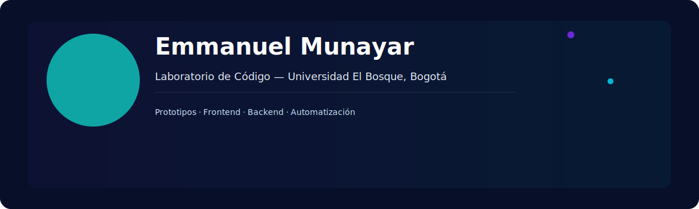

<div align="center">



## EMMA — Laboratorio de Código
### Prototipos · Producción ligera · Innovación continua

[](https://github.com/emm1223)
[](https://www.linkedin.com/in/emm1223)
[](https://wa.me/573174743252)

[](https://github.com/emm1223/emma/actions/workflows/ci.yml)

</div>

---

Resumen

EMMA es el laboratorio personal de Emmanuel Munayar para prototipos, demos y proyectos ligeros. Aquí documento soluciones rápidas, experimentos front-end y ejemplos útiles para aprendizaje y reutilización.

---

**Contacto**

- **Email:** [emmanuelmunayar@gmail.com](mailto:emmanuelmunayar@gmail.com)
- **WhatsApp:** [+57 317 474 3252](https://wa.me/573174743252)
- **LinkedIn:** https://www.linkedin.com/in/emm1223
- **GitHub:** https://github.com/emm1223

---

**Educación**

- Universidad El Bosque — Bogotá, Colombia

---

**Proyectos destacados**

- **basic/** — plantillas frontend, utilidades y experimentos.
- **basic/presentacion/** — demos y páginas estáticas (opcion1, opcion2).
- **minoviabella/** — ejemplos de páginas y cartas.

---

**Manifiesto**

> No espero la perfección: construyo, rompo, aprendo y mejoro. Este repositorio es un registro de evolución y aprendizaje continuo.

---

**Landing y vista previa**

- Hay una landing estática en `docs/`. Para verla localmente puedes servirla con un servidor estático rápido:

```bash
python3 -m http.server --directory docs 8000
# y luego abrir http://localhost:8000
```

---

**Estructura rápida**

```
basic/
  ├─ margarita.installer/
  ├─ presentacion/
minoviabella/
assets/
docs/
```

---

**Contribuir**

- Si quieres sugerir mejoras o enviar un PR, abre una issue o haz un fork y crea una pull request.
- Para cambios importantes, abre una issue primero para que podamos alinear el alcance.

---

**Cambios recientes**

- Mejora de redacción y organización del README.

---

Si quieres, puedo:

- Ajustar el diseño visual del `docs/` y la landing.
- Actualizar la portada SVG con una versión alternativa.
- Preparar la publicación automatizada en GitHub Pages.

Dime qué prefieres y lo implemento.
