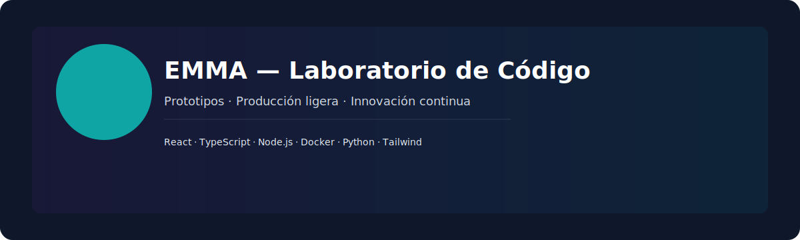

<div align="center">


## EMMA — Laboratorio de Código
### Prototipos · Producción ligera · Innovación continua

[](https://github.com/emm1223)
[](https://www.linkedin.com/in/emm1223)
[](https://wa.me/573174743252)

[](https://github.com/emm1223/emma/actions/workflows/ci.yml)
[](https://github.com/emm1223/emma/actions/workflows/pages.yml)

</div>

---

Resumen

EMMA es un laboratorio personal de desarrollo donde se construyen y documentan prototipos, demos y proyectos pequeños con enfoque en entrega rápida, calidad y aprendizaje continuo.

---

Contacto

- Email: [emmanuelmunayar@gmail.com](mailto:emmanuelmunayar@gmail.com)
- WhatsApp: [+57 317 474 3252](https://wa.me/573174743252)
- LinkedIn: https://www.linkedin.com/in/emm1223
- GitHub: https://github.com/emm1223
- Instagram: https://www.instagram.com/emm_exe.sys/

---

Educación

- Universidad El Bosque — Bogotá, Colombia

---

Proyectos destacados

- `basic/` — plantillas frontend, utilidades y experimentos.
- `basic/presentacion/` — demos y páginas estáticas (opcion1, opcion2).
- `minoviabella/` — ejemplos de páginas y cartas.

---

Manifesto breve

> No espero a la perfección: construyo, rompo, aprendo y mejoro. Este repositorio es prueba de evolución continua.

---

Docs y landing

Hay una landing estática en `docs/` (lista para GitHub Pages). Abre `docs/index.html` para ver la presentación visual.

---

Estructura rápida

```
basic/
  ├─ margarita.installer/
  ├─ presentacion/
minoviabella/
assets/
docs/
```

---

Si quieres ajustes de color, una portada SVG personalizada con tu nombre o activar GitHub Pages para `docs/`, lo hago ahora y lo publico.

---

## ✨ Lo nuevo (visual)

He eliminado contenido duplicado y limpiado la parte inferior del README. Aquí tienes secciones visuales para destacar proyectos y accesos rápidos.

<div align="center">
  
</div>

### Proyectos destacados

| Proyecto | Descripción | Demo |
|---|---|---:|
| `basic/margarita.installer` | Plantilla Tailwind + PostCSS | [Abrir](/basic/margarita.installer)
| `basic/presentacion/opcion1` | Página de presentación (HTML) | [Abrir](/basic/presentacion/opcion1/index1.html)
| `minoviabella/cartas/carta1` | Ejemplo de carta web | [Abrir](/minoviabella/cartas/carta1/index.html)

---

## 📸 Galería & Landing

La landing visual está en `docs/` — abre `docs/index.html` o activa GitHub Pages para mostrarla públicamente.

---

## 🧾 Métricas y badges

[](https://github.com/emm1223/emma)
[](https://github.com/emm1223/emma)

---

## 📬 ¿Qué quieres que haga ahora?

- `Portada` — genero una portada SVG personalizada (tu nombre, paleta, tipografía) y la incluyo en `assets/hero.svg`.
- `Publicar` — activo GitHub Pages (configuro `docs/` como fuente y creo branch si es necesario) y publico la landing.
- `Más visual` — agrego mini capturas en `assets/` y las muestro en la galería del README.

Responde con la opción y la hago de inmediato.
